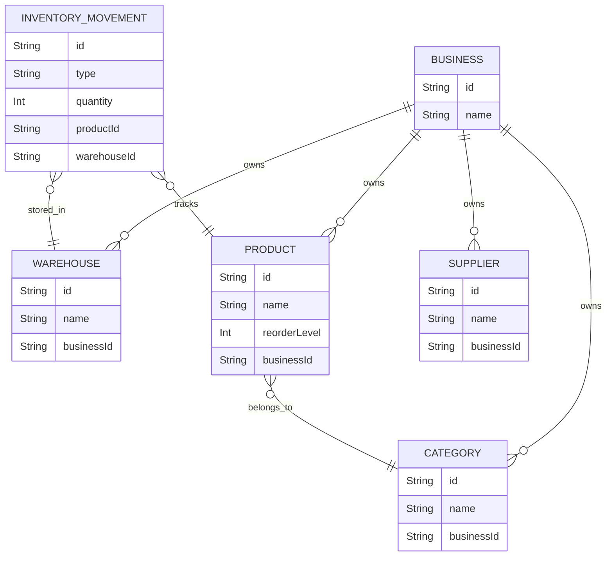

# AI-BOS Architecture Overview

AI-BOS is built on a highly modular, decoupled architecture that separates UI components from core business logic.

## 1. Core Technology Stack
- **Frontend**: Next.js 15 (App Router), React, Tailwind CSS.
- **Backend API**: Next.js Server Actions & API Routes.
- **Database**: PostgreSQL (via Neon) managed by Prisma ORM.

## 2. Design Principles
### Immutable Ledgers
To prevent data corruption, AI-BOS does not use mutable integers for critical records like stock.
- Instead of updating `product.stock = 50`, the system creates an `InventoryMovement` record.
- The `StockCalculationService` queries the database to SUM all movements, returning the live stock amount.

### Tenant Isolation
Every business object belongs to a `businessId`.
- The `Domain Services` enforce that queries and mutations always filter by the active `businessId`.
- This ensures data from Business A can never leak into Business B.

### Abstract Provider Interfaces
AI-BOS is designed to support both local deterministic AI and external LLMs (OpenAI/Gemini).
- We defined an `AIResponseProvider` interface.
- Currently, `LocalBusinessAI` implements this interface using database counts.
- In the future, a `GeminiAI` class can be swapped in without altering the UI.

## 3. Database Entity Relationship

## 4. Module Status
**Completed:**
- Authentication Framework (Bypassed for Demo)
- Architecture & Services
- Inventory (Warehouses, Categories, Products, Suppliers, Movements)
- AI CEO (Deterministic Local Engine)

**Planned (Future Sprints):**
- Purchases & Procurement
- Finance (Double-entry accounting)
- Employees & Customers
- Cloud AI Integration
